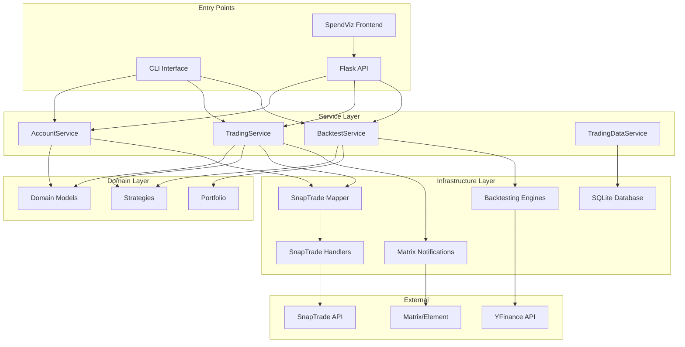

# System Patterns

## System Architecture

The solution root is `/home/ukmoon/Desktop/finance-apps`, containing both **[[markbot]]** (Python backend) and **[[spendviz]]** (TypeScript frontend).

The trading bot is designed with a modular architecture to ensure a clear separation of concerns, making it easier to develop, test, and maintain. The system follows a Domain-Driven Design (DDD) approach with clean layer separation.

### Directory Structure

```
finance-apps/
├── markbot/              # Python Trading Backend
│   ├── api/             # HTTP API Layer
│   ├── cli/             # Command Line Interface
│   ├── core/            # Application Bootstrap
│   ├── domain/          # Business Logic & Models
│   │   ├── models.py
│   │   └── strategies/
│   ├── infrastructure/  # External Dependencies
│   │   ├── snaptrade/
│   │   └── backtesting/
│   └── services/        # Application Services
├── spendviz/            # TypeScript Frontend
│   ├── src/
│   ├── backend/         # Express.js Proxy
│   └── public/
└── docker-compose.yml   # Orchestration
```

### Layer-by-Layer Architecture

#### 🏗️ **Domain Layer (`domain/`)**
*   **Purpose:** Core business rules and entities - the heart of the application
*   **Contents:**
    *   `models.py`: Pydantic domain models ([[account]], [[position]], [[trade]])
    *   `strategies/`: Trading strategy implementations
        *   `base.py`: Abstract strategy interface
        *   [[rsi-strategy]], [[momentum-strategy]], [[trend-following-strategy]]
*   **Dependencies:** None (pure business logic)

#### ⚙️ **Service Layer (`services/`)**
*   **Purpose:** Orchestrates application use cases and business workflows
*   **Contents:**
    *   `account_service.py`: User account management
    *   `trading_service.py`: Trading session orchestration
    *   `backtest_service.py`: Portfolio backtesting coordination
    *   `trading_data_service.py`: Database operations for lots/candles
*   **Pattern:** Service layer acts as bridge between entry points and domain/infrastructure

#### 🔌 **Infrastructure Layer (`infrastructure/`)**
*   **Purpose:** External world interactions (APIs, databases, file system)
*   **Contents:**
    *   `snaptrade/`: SnapTrade API handlers and mappers
    *   `backtesting/`: VectorBT and Event-Driven engines
    *   `notifications.py`: Matrix/Element integration
    *   `display.py`: CLI output formatting
*   **Pattern:** Anti-corruption layer pattern via [[snaptrade-mapper]]

#### 🏛️ **Core Layer (`core/`)**
*   **Purpose:** Application bootstrap and cross-cutting concerns
*   **Contents:**
    *   `config.py`: Configuration management
    *   `initializer.py`: Dependency injection container
    *   `order_store.py`: Local order persistence
*   **Pattern:** Dependency injection for loose coupling

#### 🌐 **Entry Points (`cli/`, `api/`)**
*   **Purpose:** User interaction boundaries - thin layers that delegate to services
*   **Contents:**
    *   `cli/main.py`: Command-line interface entry point
    *   `api/app.py`: Flask REST API entry point
*   **Pattern:** Facade pattern - simple interface to complex subsystem

## Component Relationships



## Design Patterns Implementation

### 🎯 **Dependency Injection Pattern**
- **Implementation:** `AppInitializer` in `core/initializer.py`
- **Purpose:** Central container for service instantiation and dependency management
- **Benefits:** Loose coupling, testability, configuration flexibility
- **Usage:** Flask blueprints access via `current_app.config["APP_INITIALIZER"]`

### 🏗️ **Service Layer Pattern**
- **Implementation:** `services/` directory with business logic orchestration
- **Purpose:** Bridge between entry points and domain/infrastructure layers
- **Benefits:** Centralized business logic, data normalization, transaction management
- **Example:** `TradingService` coordinates between SnapTrade API and domain strategies

### 🛡️ **Repository Pattern (Implicit)**
- **Implementation:** `order_store.py` + `snaptrade` handlers
- **Purpose:** Abstract data access layer for local and external data
- **Benefits:** Data access abstraction, testing flexibility
- **Components:**
  - `OrderStore`: Local JSON persistence
  - SnapTrade handlers: External API abstraction

### 🏰 **Domain-Driven Design with Anti-Corruption Layer**
- **Implementation:** [[snaptrade-mapper]] as ACL between external API and domain
- **Purpose:** Protect domain integrity from external API changes
- **Data Flow:**
  1. Raw SnapTrade API data → `infrastructure/snaptrade` handlers
  2. Raw data → `SnapTradeMapper` → Typed Pydantic models
  3. Domain models → Application services → Business logic
  4. Type-safe models → CLI/API presentation layers

### 🔄 **Proxy Pattern**
- **Implementation:** SpendViz backend proxy to Markbot API
- **Purpose:** Intelligent routing, authentication injection, error handling
- **Benefits:** Frontend simplification, security, protocol translation

## API Integration Patterns

### 🎭 **Facade Pattern - CLI to API Migration**

**Before (CLI Direct Access):**
```
CLI → AppInitializer → Services → SnapTrade → API
```

**After (DRY Architecture via API):**
```
CLI → HTTP Request → Flask API → Services → SnapTrade → API
SpendViz → HTTP Request → Flask API → Services → SnapTrade → API
```

**Benefits:**
- ✅ **DRY Principle**: Single API serves multiple interfaces
- ✅ **Consistency**: Same business logic across CLI and web
- ✅ **Testability**: API endpoints independently testable
- ✅ **Future-Proof**: Easy to add new interfaces

### 📊 **Portfolio Backtesting Architecture**

**Data Flow Pattern:**
```
1. SnapTrade API → AccountService → Portfolio positions
2. Symbol extraction → Domain models → Strategy parameters
3. YFinance API → Historical data → Backtesting engines
4. Strategy signals → VectorBT/Event-Driven → Performance metrics
5. Results → Service layer → API/CLI presentation
```

**Strategy Implementation Pattern:**
- **Base Strategy**: Abstract interface in `domain/strategies/base.py`
- **Concrete Strategies**: RSI, Momentum, Trend Following, MA Crossover
- **Engine Abstraction**: VectorBT vs Event-Driven execution
- **Parameter Optimization**: Optuna integration for hyperparameter tuning

## Error Handling & Resilience Patterns

### 🛡️ **Multi-Level Fallback Pattern**
```python
try:
    real_data = get_live_portfolio()  # Primary data source
    if not real_data:
        sample_data = get_sample_portfolio()  # Fallback data
except Exception as e:
    return {"error": f"Detailed: {str(e)}"}  # Graceful degradation
```

### 🔍 **Type Safety & Validation Pattern**
- **Domain Boundaries**: Pydantic models enforce type safety at system edges
- **API Validation**: Request/response validation via Flask-RESTX schemas
- **Runtime Checking**: MyPy static analysis + runtime Pydantic validation
- **Error Propagation**: Structured error responses with context

## Technical Constraints & Considerations

### 📈 **Rate Limiting Strategy**
- **SnapTrade API**: Respect rate limits via request throttling
- **YFinance API**: Cache historical data to minimize requests
- **Database**: Local caching for lot and candle data

### 🔐 **Security Patterns**
- **Configuration**: Sensitive keys in `configs/config.json` (gitignored)
- **Authentication**: User credentials injection via proxy layer
- **API Keys**: Environment-based configuration management

### 🧪 **Testing Patterns**
- **Unit Tests**: Domain logic isolation with mocked dependencies
- **Integration Tests**: API endpoint testing with test database
- **Contract Tests**: SnapTrade API response validation

## 🔗 **Related Documentation**

- [[techContext]] - Technology stack and development setup
- [[activeContext]] - Current implementation status
- [[progress]] - Development milestones and achievements
- [[projectbrief]] - Overall project scope and requirements

---

*System patterns documented with Obsidian enhanced linking for improved navigation and understanding*